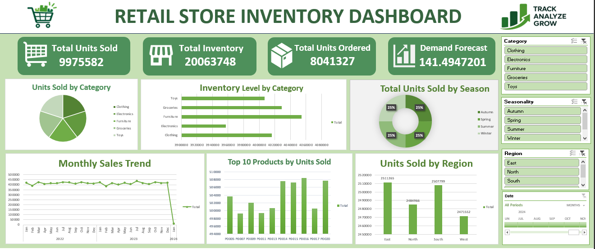

# 📊 Retail Store Inventory Dashboard

## 📌 Project Overview

An interactive Excel dashboard designed to analyze retail store
inventory, sales, orders, demand forecast, categories, seasons,
and regional performance.

## 🛠️ Tools Used

- Microsoft Excel
- Pivot Tables
- Pivot Charts
- Slicers
- Timeline
- Data Analysis

## 📊 Dashboard Features

- Total Units Sold
- Total Inventory
- Total Units Ordered
- Demand Forecast
- Units Sold by Category
- Inventory Level by Category
- Seasonal Sales Analysis
- Monthly Sales Trend
- Top 10 Products by Units Sold
- Regional Sales Analysis
- Interactive Category Filter
- Seasonality Filter
- Region Filter
- Date Timeline

## 📷 Dashboard Preview

## 👨‍💻 Author

**Khan Altaf Hussain**

B.Sc. IT Student 
